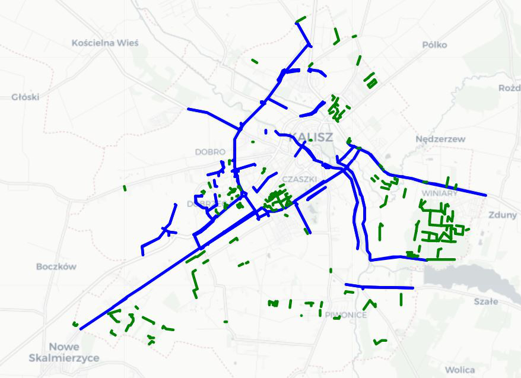

<h1> BikeGuessr </h1>

BikeGuessr is a project prepared for Wrocław University of Science and Technology (WUST), Poland Artificial Intelligence Master course in the years 2021/2022. Project contributors are:
* Vladimir Zaigrajew: vladimirzaigrajew@gmail.com
*  Jakub Belter kuba.belter@gmail.com
* Filip Drewnowski: drewnowskifilip@gmail.com
* Piotr Szymański: piotr.szymanski@pwr.edu.pl

 

<h2> About BikeGuessr </h2>

The increasing environmental awareness and desire to lead a healthy lifestyle in European societies leads to an increasing role of the bicycle in everyday life. This leads to the need for more bicycle paths in cities. The presented BikeGuessr project is able to indicate on the basis of the currently existing road network which roads should be revitalized by adding a cycle path. This is all the more important because not all cities have, or do have, units specialized in bicycle infrastructure or managers do not have enough data to indicate the most urgent investments. In this way, BikeGuessr can help reduce project preparation time and costs.
The solution works on graph data, so in order to preserve spatial relationships, it was decided to use graph neural networks. An autocoder type architecture with atry- boot masking called (GraphMAE) was chosen, this model achieves qualitatively better results than spline networks for example tasks on graphs.

<h2> Data Preprocessing </h2>

The main data source is the [OpenStreetMaps](https://www.openstreetmap.org) platform, which made up the data processing pipeline presented below.
1. Selection of cities based on diversity and cycling infrastructure development.
2. Downloading the data and extracting the street grid as a graph from the OSM platform using the OSMnx tool.
3. Selection of 11 features describing each road along with a feature coding step.
4. Transforming the graph into a linear graph so that the vertices represent the roads.
5. Assigning a label whether it is a bike path or not.
6. Adding training, validation and test masks, used in the learning process of the classifier.

 

*Fig.1 Data pipeline </figcaption*

 

<h2> Data </h2>
Data were downloaded for a total of 60 countries spread across Europe, based on the degree of development of cycling infrastructure and in an attempt to maintain diversity in the dataset.

 

*Fig.2 Cities retrieved through the pipeline used to train the model*

 

1582284 edges from 56 countries were used in the learning process. The model uses 11 features, if a feature does not occur in an edge a default value was defined.

 

*Fig.3 The proportion of total features in the learning set*

 

<h2> Training Data </h2>

Below is an example of a city in the teaching set. In the graph, roads in the city for public use are marked in blue, while bicycle roads are marked in green. The purpose of the model is to indicate which roads should be classified as bikeways. The model achieves this by learning practices from cities across Europe, and then attempts to use the knowledge gained on the knowledge transfer basis.

 

*Fig.4 Grid of public roads and cycle paths for the city of Amsterdam*

 

<h2> Visualization Of Results </h2>

Figures 5 and 6 below show the prediction results of the best model (v3 in Table 1) for Legnica. As can be seen from the visual results, the model is able to predict with good accuracy the existing bike lanes and understands that such roads should be inserted in the city center. Also it can be assumed that it distinguishes the settlements, which are not worth adding to the roads, because not most of the community would not benefit from them.

 

 
*Fig.5 (a) Positive predictions (b) Negative predictions for Legnica*

 

 

 
*Fig.6 (a) Positive predictions (b) Negative predictions for Walbrzych*

 

Since all roads are shown in Figures 5 and 6, the logical consequence would be to check the N best predictions. These results are presented in Figure 7. What can be seen is that the N most important bikeways are segments that are scattered throughout the city and do not form coherent longer routes, e.g. connecting one part of the city with another.

 

  
*Fig.7 Projected (a) top 300 (b) top 500 (c) top 1000 cycle tracks for the city of Kalisz*

 

<h2> Learning Process </h2>

The learning process of the SpatialGraphMAE (SGMAE) model is presented in the diagram in Figure 8. The DGL library has been used to implement the solution.
At first, the masked graph autoencoder is trained. It uses custom noise masks that are created every learning step. Every learning step the model is trained on each city in the training set as mini-batches. The goal of its autoencoder is to encode and decode the encoded road features as accurately as possible. It uses the rescaled cosine error as the loss function. Then, every certain number of epochs the SGMAE learning is switched to learning a classifier that is supposed to classify the roads based on the output of the encoder. Here, the masks that were created while preprocessing the data into a linear graph are used. The cross entropy is used as the loss function.

 

*Fig.8 The process of training the modelsm*

 

<h2> Visualization Of The Learning Process </h2>

Figure 9 shows the classifier results for the different versions of the models during the autocoder learning. The different versions differ in the number of encoder and decoder layers and their hidden space. The individual values are given in Table 1.

| Model | Number of layers | Size of hidden layer |
|-------|------------------|----------------------|
| v1    | 2                | 256                  |
| v2    | 3                | 512                  |
| v3    | 2                | 128                  |
| v4    | 4                | 64                   |

Table.1 Parameters of trained models

 

*Fig.9 Value of F1 measure for individual models for test data*

 

<h2> Summary </h2>

The quantitative and qualitative results indicate that the model, in the process of learning, has learned some relationships about what bike lanes look like and where they occur.
However, if the results of this model were to be used as a recommendation system, some changes would need to be made to the predicted connections to make them more transparent. Currently, a system that groups short segments into larger segments is lacking, as the best segments are scattered throughout the city.
Additionally, in terms of data, more features could be added such as traffic model data for bicycle traffic which would come at a high cost as it is difficult to access. Another type of data could be aggregated features of the area in which the edge is located (e.g., is there a store nearby, is there a park nearby).
There is a lack of models in the literature that make such predictions, so the SGMAE model is a first step in developing this area of study.
